# Personal Mermaid Notes

## Table of Contents

- [What is Mermaid?](#what-is-mermaid)
- [Basic Syntax](#basic-syntax)
- [Diagram Types Overview](#diagram-types-overview)
- [Flowchart](#flowchart)
  - [Direction](#direction)
  - [Node Shapes](#node-shapes)
  - [Link / Arrow Types](#link--arrow-types)
  - [Subgraphs](#subgraphs)
- [Sequence Diagram](#sequence-diagram)
  - [Message Arrow Types](#message-arrow-types)
  - [Loops & Conditions](#loops--conditions)
  - [Activation Bars](#activation-bars)
- [Class Diagram](#class-diagram)
  - [Visibility Modifiers](#visibility-modifiers)
  - [Relationships](#relationships)
  - [Cardinality](#cardinality)
- [State Diagram](#state-diagram)
  - [Nested States](#nested-states)
- [Entity Relationship (ER) Diagram](#entity-relationship-er-diagram)
- [Gantt Chart](#gantt-chart)
- [Pie Chart](#pie-chart)
- [Mind Map](#mind-map)
- [Git Graph](#git-graph)
- [Timeline](#timeline)
- [Quadrant Chart](#quadrant-chart)
- [Styling & Themes](#styling--themes)
  - [Built-in Themes](#built-in-themes)
  - [Node Styling](#node-styling-flowchart)
  - [CSS Classes](#css-classes)
- [Comments](#comments)
- [Common Pitfalls](#common-pitfalls)
- [Quick Reference — All Shape Syntax](#quick-reference--all-shape-syntax)
- [Setup in VS Code](#setup-in-vs-code)
- [Embedding in GitHub](#embedding-in-github)

---

## What is Mermaid?

Mermaid is a JavaScript-based diagramming tool that lets you create diagrams and charts using simple text syntax inside Markdown files.

Supported in: **GitHub**, **GitLab**, **Notion**, **Obsidian**, **VS Code** (with extensions), **Typora**, and more.

---

## Basic Syntax

Every Mermaid diagram starts by declaring its **diagram type** on the first line inside a code block tagged with `mermaid`.

````md
```mermaid
<diagram_type>
    <your content here>
```
````

---

## Diagram Types Overview

| Type | Keyword | Use Case |
|------|---------|----------|
| Flowchart | `flowchart` / `graph` | Processes, decision trees |
| Sequence | `sequenceDiagram` | Object interactions over time |
| Class | `classDiagram` | OOP class structure |
| State | `stateDiagram-v2` | State machines |
| Entity Relationship | `erDiagram` | Database schemas |
| Gantt | `gantt` | Project timelines |
| Pie Chart | `pie` | Data proportions |
| Mind Map | `mindmap` | Brainstorming / topic trees |
| Git Graph | `gitGraph` | Git branching |
| Timeline | `timeline` | Chronological events |
| Quadrant | `quadrantChart` | 2-axis categorization |

---

## Flowchart

### Direction


| Keyword | Direction |
|---------|-----------|
| `LR` | Left → Right |
| `RL` | Right → Left |
| `TB` | Top → Bottom |
| `BT` | Bottom → Top |

---

### Node Shapes

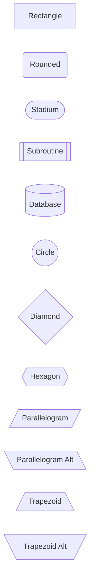

| Shape | Syntax | Meaning |
|-------|--------|---------|
| Rectangle | `[text]` | Default process step |
| Rounded | `(text)` | Start / end (soft) |
| Stadium | `([text])` | Terminal |
| Subroutine | `[[text]]` | Predefined process |
| Database | `[(text)]` | Data storage |
| Circle | `((text))` | Junction / connector |
| Diamond | `{text}` | Decision |
| Hexagon | `{{text}}` | Preparation step |
| Parallelogram | `[/text/]` | Input / output |
| Trapezoid | `[/text\]` | Manual operation |

---

### Link / Arrow Types

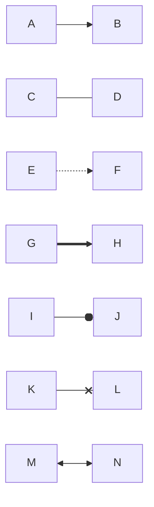

| Syntax | Meaning |
|--------|---------|
| `-->` | Arrow (directed) |
| `---` | Open line (no arrow) |
| `-.->` | Dotted arrow |
| `==>` | Thick arrow |
| `--o` | Circle end |
| `--x` | Cross end |
| `<-->` | Bidirectional |

### Arrow Labels

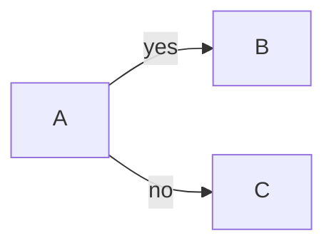

**📝 Note:** Text goes between `|pipes|` after the arrow.

---

### Subgraphs

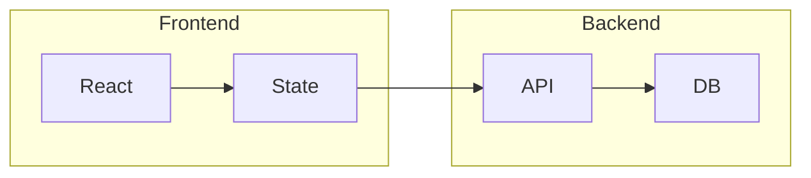

```md
subgraph <title>
    <nodes>
end
```

---

## Sequence Diagram

Used to show how objects/actors interact **over time**.

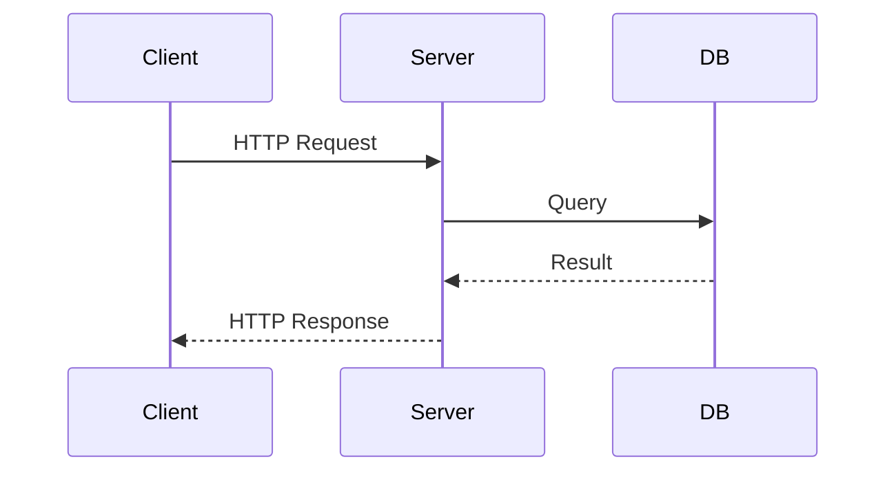

### Message Arrow Types

| Syntax | Meaning |
|--------|---------|
| `->>` | Solid arrow (sync call) |
| `-->>` | Dashed arrow (response) |
| `-x` | Solid with X (async, no reply) |
| `--x` | Dashed with X |

### Loops & Conditions

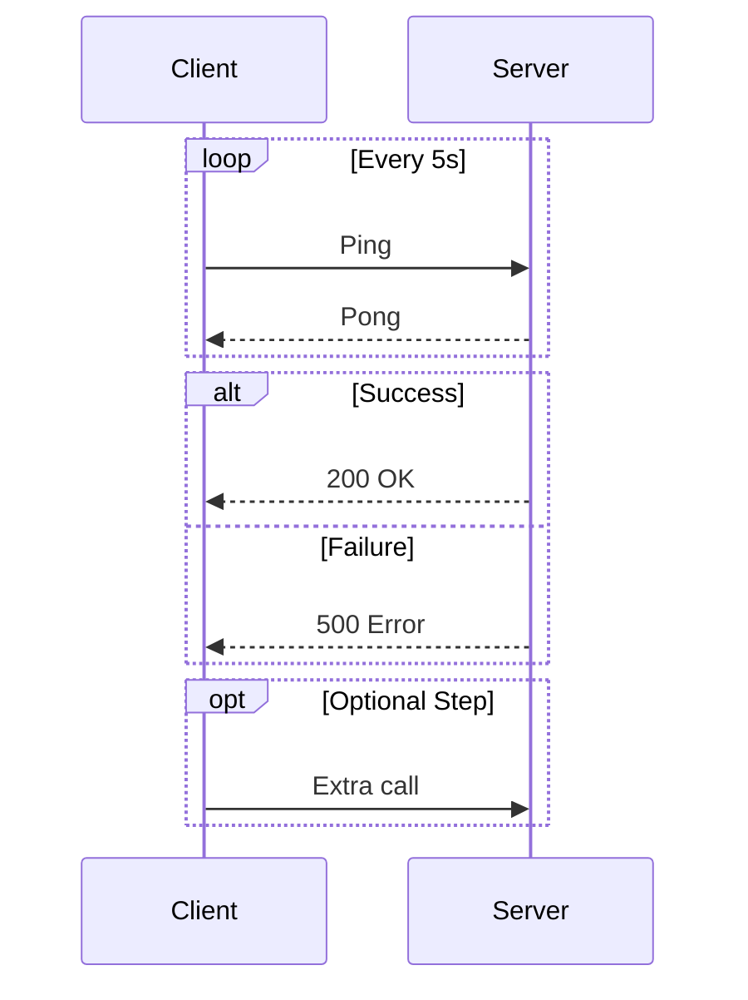

### Activation Bars

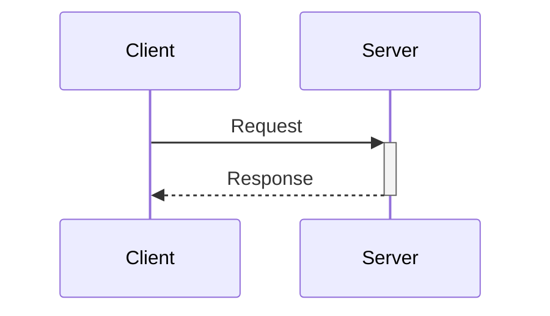

**📝 Note:** `+` activates the bar, `-` deactivates it.

---

## Class Diagram

Used to model **OOP structure**: classes, attributes, methods, and relationships.

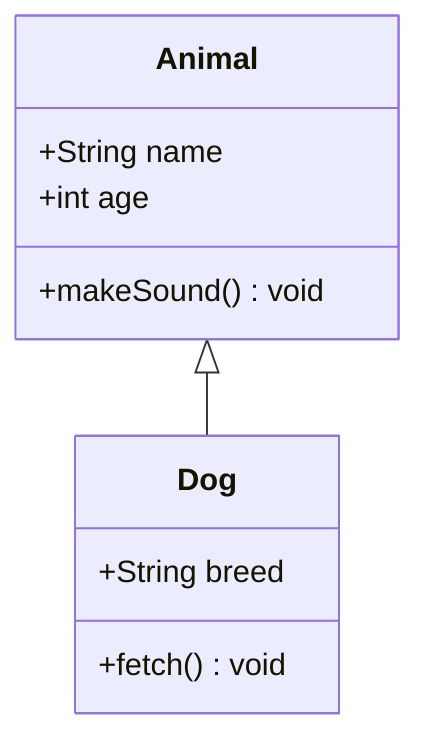

### Visibility Modifiers

| Symbol | Meaning |
|--------|---------|
| `+` | public |
| `-` | private |
| `#` | protected |
| `~` | package/internal |

### Relationships

| Syntax | Relationship |
|--------|-------------|
| `<|--` | Inheritance (extends) |
| `<|..` | Realization (implements) |
| `-->` | Association |
| `--` | Link |
| `..>` | Dependency |
| `*--` | Composition |
| `o--` | Aggregation |

### Cardinality

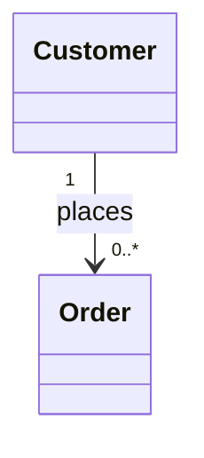

**📝 Note:** Put cardinality in quotes on each side of the arrow.

---

## State Diagram

Used to model **state machines** — how a system transitions between states.

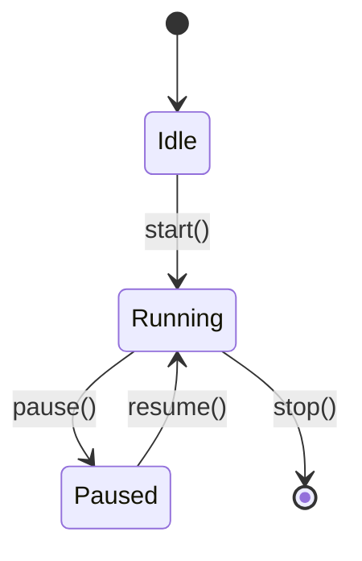

| Syntax | Meaning |
|--------|---------|
| `[*]` | Initial or final state |
| `-->` | Transition |
| `: label` | Transition label (event/action) |

### Nested States

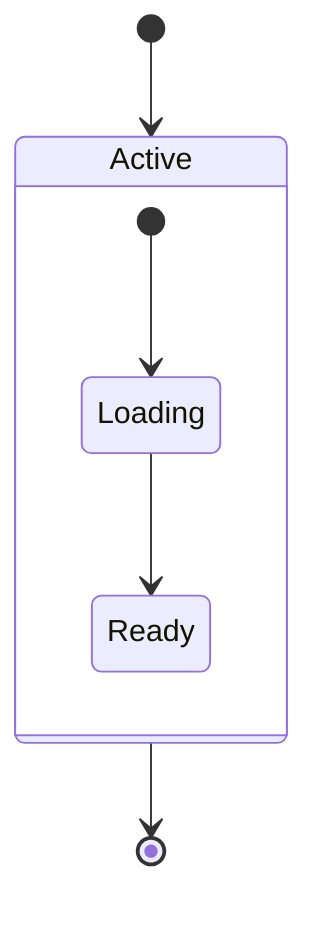

---

## Entity Relationship (ER) Diagram

Used to design **database schemas**.

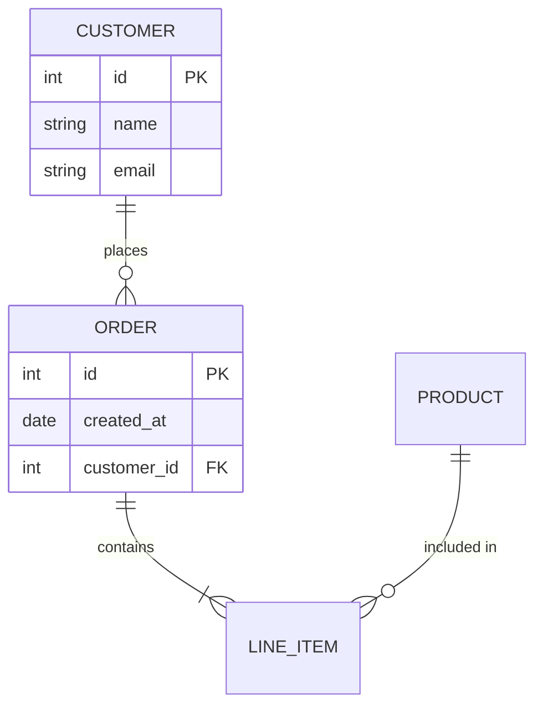

### Relationship Notation

| Left | Right | Meaning |
|------|-------|---------|
| `\|\|` | `\|\|` | Exactly one |
| `\|o` | `o\|` | Zero or one |
| `\|\{` | `\}\|` | One or more |
| `o\{` | `\}o` | Zero or more |

---

## Gantt Chart

Used to represent **project timelines and schedules**.

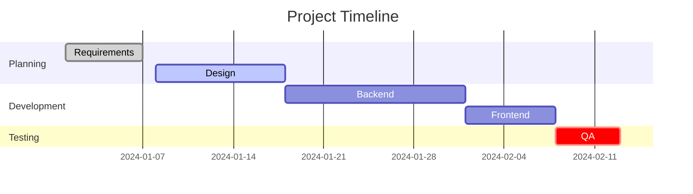

### Task Modifiers

| Keyword | Meaning |
|---------|---------|
| `done` | Completed task |
| `active` | Currently in progress |
| `crit` | Critical path |
| `after <id>` | Starts after another task |

---

## Pie Chart

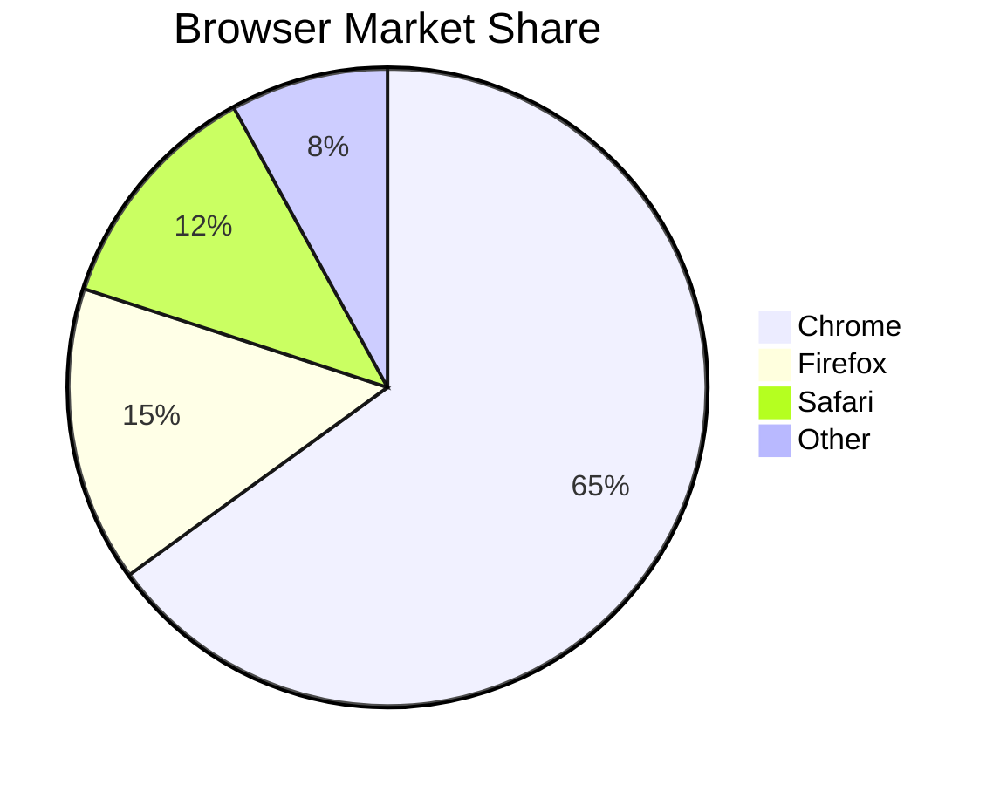

**📝 Note:** Values don't need to add up to 100 — Mermaid calculates percentages automatically.

---

## Mind Map

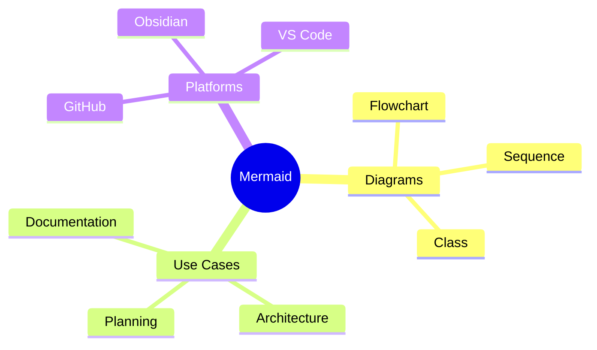

**📝 Note:** Indentation defines the hierarchy. The root node uses `(())` for a circle shape.

---

## Git Graph

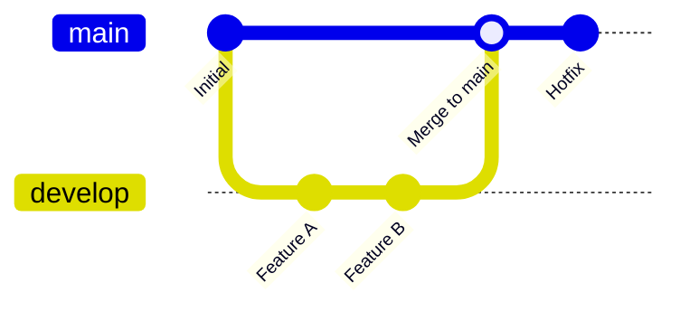

### Commands

| Command | Description |
|---------|-------------|
| `commit` | Add a commit |
| `branch <name>` | Create new branch |
| `checkout <name>` | Switch to branch |
| `merge <name>` | Merge branch into current |

---

## Timeline

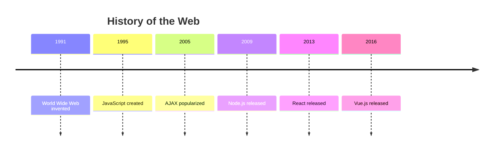

---

## Quadrant Chart

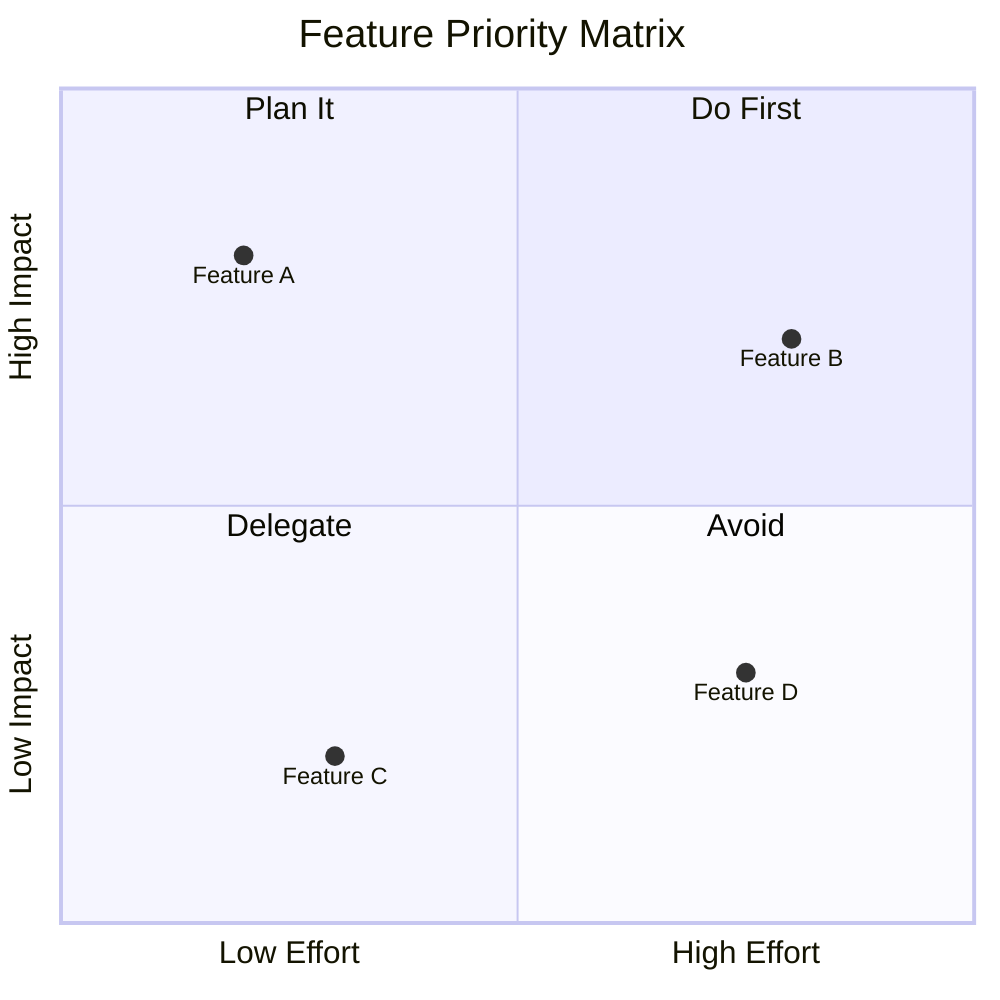

**📝 Note:** Coordinates are `[x, y]` between `0` and `1`.

---

## Styling & Themes

### Built-in Themes

```md
%%{init: {'theme': 'dark'}}%%
```

| Theme | Description |
|-------|-------------|
| `default` | Light theme |
| `dark` | Dark background |
| `forest` | Green tones |
| `neutral` | Monochrome |
| `base` | Customizable base |

### Node Styling (Flowchart)

```mermaid
flowchart LR
    A[Start] --> B[Process]
    style A fill:#4CAF50,color:#fff,stroke:#388E3C
    style B fill:#2196F3,color:#fff,stroke:#1565C0
```

```md
style <nodeId> fill:<color>, stroke:<color>, color:<textColor>
```

### CSS Classes

```mermaid
flowchart LR
    A:::greenBox --> B:::blueBox
    classDef greenBox fill:#4CAF50,color:white
    classDef blueBox fill:#2196F3,color:white
```

**📝 Note:** Apply with `:::className` after the node ID.

---

## Comments

```mermaid
flowchart LR
    %% This is a comment
    A --> B
```

Use `%%` for single-line comments anywhere in the diagram.

---

## Common Pitfalls

### ⚠️ Special Characters in Labels

If your label contains `(`, `)`, `[`, `]`, or quotes — wrap it in **quotes**:

```mermaid
flowchart LR
    A["User (Authenticated)"] --> B["Dashboard [Main]"]
```

### ⚠️ Direction Must Be First Line

```mermaid
flowchart TD   %%  ✅ direction declared on same line as type
    A --> B
```

### ⚠️ Indentation Matters in Mind Maps

Mind map hierarchy is purely indent-based. Mixing tabs and spaces will break it.

### ⚠️ ER Attribute Syntax

Each attribute must be on its own line:

```md
ENTITY {
    type name constraint
}
```

---

## Quick Reference — All Shape Syntax

```mermaid
flowchart TD
    A[Rectangle]
    B(Rounded Rectangle)
    C([Stadium / Pill])
    D[[Subroutine]]
    E[(Cylinder / DB)]
    F((Circle))
    G{Diamond}
    H{{Hexagon}}
    I[/Parallelogram/]
    J[\Parallelogram Alt\]
    K[/Trapezoid\]
    L[\Trapezoid Alt/]
```

---

## Setup in VS Code

1. Install extension: **Mermaid Preview** or **Markdown Preview Mermaid Support**
2. Open any `.md` file
3. Use `Ctrl+Shift+V` to preview

### Live Editor (No Install)

Visit **[mermaid.live](https://mermaid.live)** — paste code, see diagram instantly.

---

## Embedding in GitHub

GitHub renders Mermaid automatically in `.md` files:

````md
```mermaid
flowchart LR
    A --> B
```
````

**⚠️ Warning:** Not all Mermaid diagram types are supported on all platforms. Flowcharts, sequence, and class diagrams have the widest support.
