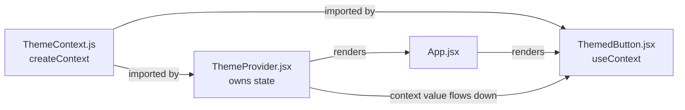
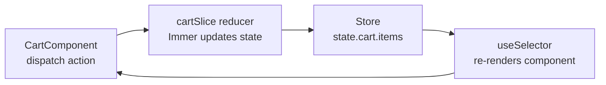
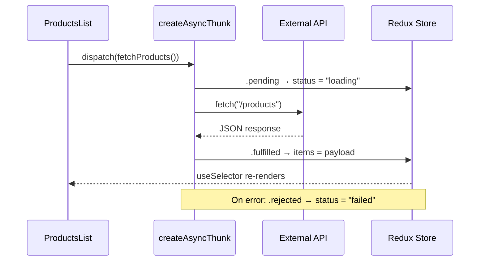

quick start

npm create vite@latest  
npm install tailwindcss @tailwindcss/vite


# React Notes — From a SwiftUI Developer's Perspective

---

## Components

React components are just functions that return JSX (HTML-like syntax).

```jsx
// SwiftUI
struct NavButton: View { ... }

// React equivalent
const NavButton = () => { return (...) }
```

### When to make a component
- If you'd repeat it more than twice, it's a component
- Don't split too small — a single icon with no logic doesn't need its own component

---

## Props

Props are just init parameters. They come in as an object, so always destructure with `{}`.

```jsx
// ❌ wrong — href is the entire props object
const Button = (href) => { ... }

// ✅ correct
const Button = ({ href }) => { ... }
```

Passing props:
```jsx
<NavButton icon={faHome} label="Home" href="/" />
```

Spread operator — unpack all object properties as props:
```jsx
// these are identical
<NavButton icon={link.icon} label={link.label} href={link.href} />
<NavButton {...link} />
```

---

## SwiftUI → React Mental Model

| SwiftUI | React |
|---|---|
| `struct NavButton: View` | `function NavButton()` |
| Init parameters | Props |
| `@State` | `useState()` |
| `@Binding` | Pass a setter function as a prop |
| `ForEach` | `.map()` |

---

## Lists with .map()

`.map()` loops over an array and transforms each item. Equivalent to `ForEach` in SwiftUI.

```jsx
// SwiftUI
ForEach(links) { link in
  NavButton(...)
}

// React
links.map((link) => (
  <NavButton key={link.href} {...link} />
))
```

### The return gotcha
```jsx
// ❌ returns nothing — curly braces need explicit return
links.map(link => {
  <NavButton ... />
})

// ✅ explicit return
links.map(link => {
  return <NavButton ... />
})

// ✅ implicit return — no curly braces
links.map(link =>
  <NavButton ... />
)
```

### key prop
React requires a unique `key` on each item in a list so it can track them. Give it any unique value.

---

## JSX

`{}` in JSX means "escape to JavaScript":
```jsx
<h2 className="text-8xl">{myVariable}</h2>
```

---

## Fragments

Fragments `<>...</>` let you return multiple elements without adding an extra div to the DOM. Only use them when needed — a single element doesn't need a fragment wrapper.

---

## Font Awesome Setup

Install:
```bash
npm i --save @fortawesome/react-fontawesome
npm i --save @fortawesome/free-solid-svg-icons
```

- `react-fontawesome` — the `<FontAwesomeIcon>` component (the renderer)
- `free-solid-svg-icons` — the actual icon files

Usage:
```jsx
import { FontAwesomeIcon } from '@fortawesome/react-fontawesome'
import { faHome } from '@fortawesome/free-solid-svg-icons'

<FontAwesomeIcon icon={faHome} />
```

Icon naming: `house-user` → `faHouseUser` (camelCase, fa prefix)

Find icons at: **fontawesome.com/search** (filter by Free)

---

## Tailwind Setup (Vite)

Install:
```bash
npm install tailwindcss @tailwindcss/vite
```

`vite.config.js`:
```js
import tailwindcss from '@tailwindcss/vite'

export default defineConfig({
  plugins: [react(), tailwindcss()],
})
```

`index.css` — import once here, available everywhere:
```css
@import "tailwindcss";
```

---

## Tailwind Colors

Pattern: `property-color-shade`

```jsx
text-red-500        // text color
bg-blue-900         // background color
border-green-300    // border color
hover:text-white    // on hover
```

Shades go from `50` (almost white) to `950` (almost black). `500` is the pure mid tone.

Custom hex — use square brackets:
```jsx
bg-[#0a1028]
text-[#ff6b35]
w-[340px]
```

Global custom color — define in `index.css` as a CSS variable:
```css
:root {
  --color-brand-bg: #0a1028;
}
```
```jsx
<nav className="bg-(--color-brand-bg)">
```

---

## Tailwind Gradients

```jsx
<div className="bg-gradient-to-r from-blue-500 to-purple-500">
```

Directions: `to-r` `to-l` `to-t` `to-b` `to-tr` `to-bl`

Optional middle color:
```jsx
<div className="bg-gradient-to-r from-blue-500 via-purple-400 to-pink-500">
```

---

## Gradient Text (Tailwind)

Tailwind doesn't have a `text-gradient` class. It's a CSS trick:

```jsx
<h2 className="inline-block bg-gradient-to-r from-pink-500 to-violet-500 bg-clip-text text-transparent">
  Hello
</h2>
```

- `bg-gradient-to-r` — creates the gradient as a background
- `bg-clip-text` — clips that background to only show through text
- `text-transparent` — makes text see-through so the background shows
- `inline-block` — **required** so the element is only as wide as the text, otherwise gradient spreads across full width and you only see one color

---

## Tailwind Hover

```jsx
<a className="text-white hover:text-sky-400 transition-colors duration-300">
```

`transition-colors` — smoothly animates color changes
`transition-all` — animates everything
`duration-300` — 300ms (options: `100` `200` `300` `500` `700`)

---

## Group Hover (Parent → Child)

When a child needs to react to a parent's hover:

```jsx
// mark the parent with group
<a className="group ...">
  // child uses group-hover:
  <FontAwesomeIcon className="group-hover:text-pink-500" />
</a>
```

`hover:` on the child won't work because you're not hovering the child directly — you're hovering the parent.

---

## Left-to-Right Fill Animation

CSS can't interpolate between gradients, so `transition-all` won't smoothly animate a gradient fill. Use a pseudo element trick instead:

```css
/* index.css */
.btn-fill {
  position: relative;  /* anchor for the pseudo element */
  overflow: hidden;    /* clip the fill during animation */
  background: transparent;
}

.btn-fill::before {
  content: '';         /* required for ::before to render */
  position: absolute;  /* positioned relative to .btn-fill */
  inset: 0;            /* stretch to cover entire button */
  background: linear-gradient(to right, #ec4899, #8b5cf6);
  transform: scaleX(0);        /* start at 0 width */
  transform-origin: left;      /* grow from left edge */
  transition: transform 0.4s ease;
  z-index: 0;
}

.btn-fill:hover::before {
  transform: scaleX(1);  /* expand to full width on hover */
}

.btn-fill:hover {
  -webkit-text-fill-color: #fff;  /* force text white on hover */
}
```

```jsx
<button className='btn-fill border-2 border-pink-500 rounded-lg text-white px-6 py-3'>
  <span className="relative z-10">Resume</span>
  {/* relative + z-10 keeps text above the animated background */}
</button>
```

### Why z-index needs position
`z-index` only works on elements with a `position` set (`relative`, `absolute`, `fixed`). Tailwind's `relative` class sets `position: relative`.

---

## Centering vs Text Alignment

These are two different problems:

- `items-center` / `justify-center` → positions **flex children** on the page
- `text-left` / `text-center` → aligns **text** inside an element

Common pattern — centered block, left-aligned text:
```jsx
// option 1 — use text-left directly
<div className="flex flex-col items-center justify-center h-screen">
  <h2 className="text-left">Hello</h2>
</div>

// option 2 — inner container (more control)
<div className="flex flex-col items-center justify-center h-screen">
  <div className="max-w-4xl w-full px-8">
    <h2>Hello</h2>
  </div>
</div>
```

---

## Height Units

```jsx
h-screen    // 100vh
h-svh       // 100svh — better for mobile (accounts for browser address bar)
h-[50vh]    // arbitrary value
```

Use `h-svh` for hero sections — `h-screen` can cause unwanted scrollbars on mobile.

---

## Standard Paragraph

```jsx
<p className="text-lg text-slate-300 leading-relaxed max-w-xl mt-4">
  Your text here
</p>
```

- `text-slate-300` — slightly dimmed white is easier on the eyes than pure white on dark backgrounds
- `leading-relaxed` — comfortable line height
- `max-w-xl` — limits line width for readability (60-75 chars is the sweet spot)

---

## Useful Resources

- **tailwindcss.com/docs** — search any property
- **tailwindcss.com/docs/colors** — visual color grid
- **fontawesome.com/search** — find and copy icon names
- **uigradients.com** — gradient ideas


# React & HTML Study Notes

## 1. Download Link in HTML

The `download` attribute on an `<a>` tag triggers a file download instead of navigation.

```html
<a href="/cv.pdf" download="John_CV.pdf">Download CV</a>
```

- `download` with no value → uses the original filename
- `download=""` → same as just `download`, uses original filename
- `download="name.pdf"` → renames the file on download

---

## 2. Where to Put Static Files in React

Put downloadable files (like CVs) in the `public/` folder, not `src/assets/`.

```
public/
  cv.pdf  ✅

src/assets/
  cv.pdf  ❌ (goes through bundler, not ideal for downloads)
```

Reference it with a root-relative path:
```jsx
<a href="/cv.pdf" download>Download CV</a>
```

---

## 3. If Conditions in JSX

You can't use `if` directly inside JSX — use expressions instead.

**`&&` (show or nothing):**
```jsx
{isLoggedIn && <a href="/cv.pdf" download>Download CV</a>}
```

**Ternary (show one or the other):**
```jsx
{isLoggedIn ? <a href="/cv.pdf">Download</a> : <p>Please log in</p>}
```

**Regular `if` outside JSX:**
```jsx
if (!isLoggedIn) return <p>Please log in</p>;
return <a href="/cv.pdf">Download</a>;
```

---

## 4. Reusable Button Component with Optional Download

```jsx
function Button({ href, download, children }) {
  return (
    <a href={href} download={download ? download : undefined}>
      {children}
    </a>
  );
}
```

React ignores attributes that are `undefined`, so if `download` is not passed, it simply won't appear on the `<a>` tag.

**Usage:**
```jsx
// With download
<Button href="/cv.pdf" download="John_CV.pdf">Download CV</Button>

// Without download (regular link)
<Button href="/about">About Me</Button>

// Email link
<Button href="mailto:you@email.com">Send me an email</Button>
```

---

## 5. The `children` Prop

Whatever you put between opening and closing tags becomes the `children` prop automatically.

```jsx
<Button href="/cv.pdf">
  Download CV   {/* this is children */}
</Button>
```

- It **must** be named `children` to work with the between-tags syntax
- If you rename it, you have to pass it as a regular prop instead

```jsx
// If you rename it, use it as a prop
function Button({ href, label }) {
  return <a href={href}>{label}</a>;
}
<Button href="/cv.pdf" label="Download CV" />
```

---

## 6. Self-closing vs Open/Close Tags

```jsx
<Button />                        // self-closing, no children
<Button>Click me</Button>         // open/close, has children
```

Both are valid — depends on whether your component uses `children` or not.

---

## 7. Spread Operator on Props `{...obj}`

Spreading an object onto a JSX element turns each key into a prop.

```js
const link = { href: "/about", icon: "😊", label: "About" }
```

```jsx
<IconLink {...link} />
// is the same as
<IconLink href="/about" icon="😊" label="About" />
```

- The `...` spread operator is **JavaScript**
- Spreading onto JSX props is **React**

---

## 8. The `&&` Operator Returns Values, Not Booleans

`&&` returns the **actual value** it stops at, not just `true` or `false`.

```js
"cv.pdf" && { download: "cv.pdf" }  // returns { download: "cv.pdf" }
false   && { download: "cv.pdf" }   // returns false
```

This is called **short circuit evaluation**. This is why this works:

```jsx
{...(download && { download })}
// if download = "cv.pdf" → spreads { download: "cv.pdf" } → adds the attribute
// if download = undefined → spreads false → adds nothing
```

---

## 9. `mailto:` Links

Opens the user's default email app when clicked.

```html
<a href="mailto:you@email.com">Send me an email</a>
```

With subject and body pre-filled:
```html
<a href="mailto:you@email.com?subject=Hello&body=I wanted to reach out...">
  Send me an email
</a>
```

---

## 10. Circular Images in Tailwind

```jsx

```

- `rounded-full` → makes it a circle
- `w-` and `h-` must be **equal** or you get an oval
- `object-cover` → fills the circle and crops if needed (best for profile pictures)

**Common sizes (numbers = 4px increments):**
```
w-16 h-16  →  64px
w-24 h-24  →  96px
w-32 h-32  → 128px
w-48 h-48  → 192px
```

**Object fit options:**
```
object-cover    → fills circle, crops image ✅ (use this for profile pics)
object-contain  → fits whole image, may leave gaps
object-fill     → stretches image (can distort)
object-none     → no scaling
```

# Tailwind Dynamic Colors & Glow Effects in React

## 1. Passing Colors as Props

**Never construct class names dynamically** — Tailwind purges classes it doesn't see as full strings at build time.

```jsx
// ❌ Won't work
const bg = `bg-${color}-500`;

// ✅ Works — full class name passed as a prop
<SkillCard bgColor="bg-violet-500" />
```

Use a lookup map for a cleaner API:

```jsx
const colorMap = {
  blue:  "bg-blue-500",
  red:   "bg-red-500",
  green: "bg-green-500",
};

function Button({ color = "blue" }) {
  return <button className={`${colorMap[color]} text-white px-4 py-2`}>Click</button>;
}
```

---

## 2. Template Literals in className

Use **backticks**, not single quotes, when injecting variables into className.

```jsx
// ❌ bgColor is treated as plain text
<span className={'text-white ${bgColor} rounded-full'}>

// ✅ bgColor is interpolated correctly
<span className={`text-white ${bgColor} rounded-full`}>
```

---

## 3. Making Skill Cards Pop

Key visual upgrades for a badge/tag component:

| Technique | Tailwind Classes |
|---|---|
| Hover scale | `hover:scale-105 transition-all duration-200` |
| Gradient bg | `bg-gradient-to-r from-violet-500 to-purple-700` |
| Letter spacing | `font-semibold tracking-wide` |
| Cursor feel | `cursor-default` |

---

## 4. Glow Effect on Dark Backgrounds

Use arbitrary `shadow-[...]` values with **x/y set to 0** so the shadow spreads evenly (glow) instead of casting directionally.

```
shadow-[0_0_15px_rgba(139,92,246,0.8)]
         ↑ ↑  ↑    ↑
         x y  blur  color + opacity
```

Intensify on hover:

```jsx
// Rest state — soft glow
shadow-[0_0_15px_rgba(139,92,246,0.8)]

// Hover state — bright glow
hover:shadow-[0_0_25px_rgba(139,92,246,1)]
```

### Color Reference

| Color | RGBA |
|---|---|
| Violet | `rgba(139, 92, 246, 0.8)` |
| Purple | `rgba(168, 85, 247, 0.8)` |
| Pink | `rgba(244, 114, 182, 0.8)` |
| Rose | `rgba(244, 63, 94, 0.8)` |
| Cyan | `rgba(34, 211, 238, 0.8)` |

---

## 5. The Override Gotcha

`shadow-md` and `hover:shadow-lg` are generic dark shadows that **overwrite** custom `shadow-[...]` values. Remove them when using a custom glow.

```jsx
// ❌ shadow-md kills your glow
className={`${bgColor} shadow-md hover:shadow-lg`}

// ✅ Let your custom shadow do the work
className={`${bgColor} hover:scale-105 transition-all duration-200`}
```

---

## Final SkillCard

```jsx
// Colors defined with gradient + glow
let technicalColor = "bg-gradient-to-r from-violet-500 to-purple-700 shadow-[0_0_15px_rgba(139,92,246,0.8)] hover:shadow-[0_0_25px_rgba(139,92,246,1)]";
let softColor      = "bg-gradient-to-r from-pink-400 to-rose-500 shadow-[0_0_15px_rgba(244,114,182,0.8)] hover:shadow-[0_0_25px_rgba(244,114,182,1)]";

// Component — no shadow-md or shadow-lg
const SkillCard = ({ skill, bgColor }) => {
  return (
    <span className={`
      text-xl font-semibold tracking-wide text-white
      ${bgColor}
      rounded-full px-5 py-2
      hover:scale-105
      transition-all duration-200 cursor-default
      inline-flex items-center gap-2
    `}>
      {skill}
    </span>
  );
};
```


# React Session Wrap-Up

## Key Concepts Learned

### 1. State and Arrays
Never mutate state directly. React compares references to detect changes — mutating an array or object in place means React sees the same reference and skips the re-render.

**The rule:**
- `.push()`, `.splice()`, direct assignment → mutates → bad
- `.filter()`, `.map()`, spread `[...arr]` → new array → good

```js
// ❌ Wrong
list.push(item)
setList(list)

// ✅ Correct
setList([...list, item])
```

---

### 2. Spread Syntax — Arrays vs Objects

```js
// Array → use []
setList([...list, newItem])

// Object → use {}
setTodo({ ...todo, status: "finished" })
```

Spread inside `{}` or `[]` creates a **new reference**. Spread directly into a function call is invalid.

```js
// ❌ Wrong — spreads values as multiple arguments
setTodo(...todo, { id: 1 })

// ✅ Correct — one new object
setTodo({ ...todo, id: 1 })
```

---

### 3. setState is Not Synchronous

React batches state updates and applies them **after your function finishes**. The state variable still holds the old value on the next line.

```js
// ❌ stale — todoCopy hasn't updated yet
setTodo([...todoCopy, todo])
setTodoHelper()  // reads old todoCopy

// ✅ build new value first, pass it everywhere
const newList = [...todoCopy, todo]
setTodo(newList)
setTodoHelper(newList)
```

---

### 4. Primitives vs References

React uses `Object.is()` to compare old and new state.

| Type | Compared by | Example |
|---|---|---|
| Number, string, boolean | Value | `5 === 5` ✅ |
| Array, Object | Reference (memory address) | `[] === []` ❌ |

This is why `setState(5)` works fine but mutating an array doesn't trigger a re-render.

---

### 5. What a Render Is

A render is React **calling your component function** and reading the returned JSX. Every render is a frozen snapshot — all variables inside are fixed to the values at that moment.

```
state changes → React calls your function → reads new JSX → diffs with previous → updates DOM
```

This is why a stale variable inside a function is always the value from **that render**, not the next one.

---

### 6. Mutation and Data Integrity

Even when mutation "works" (new array reference triggers re-render), it corrupts your original data.

```js
// .map() gives a new array — React re-renders ✅
// BUT objects inside still point to the same memory
const newList = todoCopy.map(todo => {
  todo.status = "finished"  // corrupts the original object ❌
  return todo
})
```

The imported `Todo` source data gets permanently modified for the entire session. Always spread into a new object:

```js
todoCopy.map(todo =>
  todo.id === id ? { ...todo, status: "finished" } : todo
)
```

---

### 7. Redundant State (Key Takeaway)

Having `todoCopy`, `todoPending`, and `todoDone` as three separate states for the same data forces manual sync via a helper and is error-prone.

```js
// ❌ Three states, manual sync required
const [todoCopy, setTodo] = useState(Todo)
const [todoDone, setDone] = useState(...)
const [todoPending, setPending] = useState(...)

// ✅ One state, derive the rest — always in sync automatically
const [todos, setTodos] = useState(Todo)
const todoPending = todos.filter(todo => todo.status === AVILABLE_STATUS.PENDING)
const todoDone = todos.filter(todo => todo.status === AVILABLE_STATUS.FINISHED)
```

---

## Struggles Faced

### Props Destructuring
```js
// ❌ lastId and handleAdd are both undefined
const TodoAdd = (lastId, handleAdd) => {}

// ✅ Props come as one object
const TodoAdd = ({ lastId, handleAdd }) => {}
```

### `onSubmit` on a Button
`onSubmit` belongs to `<form>`, not `<button>`. Buttons use `onClick`.

### `==` vs `===`
Loose equality (`==`) causes silent bugs when comparing ids of mixed types (e.g. string `"1"` vs number `1`). Always use strict equality (`===`).

### Missing Return in `.map()`
```js
// ❌ Curly braces with no return — renders nothing
{list.map(item => { <Card /> })}

// ✅ Parentheses — implicitly returns
{list.map(item => ( <Card /> ))}
```

### `setTodo` Stale State in Helper
Calling a helper right after `setState` read stale data because React hadn't applied the update yet. Fixed by building the new array into a variable first and passing it directly.

### Ternary Assignment Bug
```js
// ❌ Returns the assigned VALUE (a string), not the object
todo.id === id ? todo.status = "finished" : todo

// ✅ Returns a new object
todo.id === id ? { ...todo, status: "finished" } : todo
```

### `handleAdd` Called on Every Keystroke
`handleAdd` was being called inside `handleChange` instead of `handleSubmit`, so a todo was added on every key press instead of on button click.

---

## Flex Direction Quick Reference

| Class | Direction | Items go |
|---|---|---|
| `flex-row` | Horizontal → | Side by side |
| `flex-col` | Vertical ↓ | Stacked on top of each other |

---

## The Golden Rules

> Always pass a **new array or object** to the setter — never mutate.

> Build your new value in a **regular variable first**, then pass it to both the setter and any helper.

> Derive state from a **single source of truth** instead of keeping multiple states in sync.


# Session Summary — April 04, 2026 — React Routing & Product UI

## What We Covered
A full React session covering client-side routing with React Router, data fetching with the Fetch API, state management with hooks, and Tailwind CSS styling across multiple components including a navbar, product card, product details page, and increment/decrement button.

---

## Key Concepts Learned

- **Client-Side Navigation vs Full Page Reload**
  - What it is: React Router intercepts navigation in JavaScript using the History API, swapping components without hitting the server
  - Why it matters: Full page reloads break the SPA model and reset all state
  - Doc: https://reactrouter.com/start/concepts

- **Router Context**
  - What it is: `<BrowserRouter>` provides a context that all routing-aware components (`NavLink`, `useParams`, `useLocation`) must be descendants of
  - Why it matters: Any routing component outside `<BrowserRouter>` throws a context error
  - Doc: https://reactrouter.com/en/main/router-components/browser-router

- **New JSX Transform (React 17+)**
  - What it is: The compiler auto-imports the JSX runtime, eliminating the need for `import React from 'react'` in every file
  - Why it matters: Cleaner files; but React 16 and below still require the manual import
  - Doc: https://legacy.reactjs.org/blog/2020/09/22/introducing-the-new-jsx-transform.html

- **JavaScript in JSX with Curly Braces `{}`**
  - What it is: Curly braces are the escape hatch from JSX markup into JavaScript expressions
  - Why it matters: Enables dynamic rendering — variables, conditionals, and iteration
  - Doc: https://react.dev/learn/javascript-in-jsx-with-curly-braces

- **Two-Step Fetch Pattern**
  - What it is: `fetch()` returns a `Response` object; you must call `.json()` on it to extract and parse the body
  - Why it matters: Skipping step two means you're passing a `Promise` or `Response` object into state instead of data
  - Doc: https://developer.mozilla.org/en-US/docs/Web/API/fetch

- **`useState` Initial Value & Loading Guards**
  - What it is: The initial value passed to `useState` is what React renders on the first pass, before any async data arrives
  - Why it matters: Accessing properties like `.images.at(0)` on `undefined` or `{}` crashes the render
  - Pattern: Use a dedicated `isLoading` state and guard the render with `if(isLoading) return <h1>Loading...</h1>`
  - Doc: https://react.dev/reference/react/useState#parameters

- **Falsy Values in JavaScript**
  - What it is: `{}` is truthy — so `!{}` is `false`, meaning a guard like `if(!productDetails)` never triggers when initial state is `{}`
  - Why it matters: Guards must check something meaningful, like a specific property that only exists after data loads
  - Doc: https://developer.mozilla.org/en-US/docs/Glossary/Falsy

- **`async` Functions Always Return a Promise**
  - What it is: Calling an `async` function always returns a `Promise`, even if you `return` data inside it
  - Why it matters: `setProductDetails(fetchProductDetails())` sets state to a Promise, not the data
  - Fix: Call `setProductDetails(data)` **inside** the async function after awaiting
  - Doc: https://developer.mozilla.org/en-US/docs/Web/JavaScript/Reference/Statements/async_function#return_value

- **Inline vs Block Elements & Flex Layout**
  - What it is: `<Link>` renders as an `<a>` (inline element) — wrapping a `<button>` inside it breaks flex participation
  - Why it matters: `flex-1` on the button has no effect when its parent `<a>` is inline and not a flex child
  - Fix: Either style the `<Link>` itself as the button, or give the `<Link>` `flex-1` and the button `w-full`
  - Doc: https://developer.mozilla.org/en-US/docs/Web/HTML/Inline_elements

---

## Problems We Worked Through

| Problem | Root Cause | Resolution |
|---|---|---|
| `useLocation()` context error | `<NavBar>` was rendered outside `<BrowserRouter>` | Moved `<NavBar>` inside `<BrowserRouter>` |
| Vite redeclaration syntax error | Stale HMR state after restructuring | Full browser refresh / dev server restart |
| `JSON.parse` on fetch response | Called `JSON.parse(data)` instead of `response.json()` | Used the two-step fetch pattern |
| `productDetails` undefined crash | `setProductDetails` called outside async function, receiving a Promise | Moved `setProductDetails(data)` inside the async function |
| Images and tags crashing on first render | Initial state `{}` has no `images` or `tags` properties | Added `isLoading` state; guard render until data is ready |
| Buy Now button layout broken | `<button>` nested inside `<Link>` — inline element breaks flex | Styled `<Link>` directly as the button with `flex-1` |

---

## Code Patterns Introduced

```jsx
// Two-step fetch pattern
const fetchProductDetails = async () => {
  const data = await fetch(`/products/${id}`)
    .then(response => {
      if (!response.ok) throw new Error("Server error");
      return response.json(); // step 2 — parse the body
    });
  setProductDetails(data); // set state INSIDE the async function
};
```

```jsx
// Loading guard pattern
const [isLoading, setIsLoading] = useState(true);

if (isLoading) return <h1>Loading...</h1>; // guard before full render
```

```jsx
// Absolute badge positioned over an image
<div className="relative">
  
  <span className="absolute top-2 right-2 bg-green-500 text-white text-xs px-2 py-1 rounded-full">
    In Stock
  </span>
</div>
```

```jsx
// Link as button — avoids invalid nesting
<Link
  to="/cart"
  className="flex-1 bg-orange-700 text-white py-3 rounded-lg hover:bg-orange-900 transition-colors text-center">
  Buy now
</Link>
```

```jsx
// NavLink with active state styling
<NavLink
  to="/"
  className={({ isActive }) =>
    `flex items-center gap-2 transition-colors ${isActive ? "text-white font-bold" : "text-gray-300 hover:text-white"}`
  }>
  Home
</NavLink>
```

---

## What to Tackle Next

- **Active NavLink styling** — you were close; use the `className` function pattern to highlight the current route
- **Error state handling** — you have `!response.ok` checks but return JSX from a fetch function; learn the proper pattern using `try/catch` and an `error` state
- **Cart state management** — your Add to Cart and Buy Now buttons don't do anything yet; this is a great intro to `useContext` or a state management library like Zustand
- **Responsive design** — apply Tailwind's `sm:`, `md:`, `lg:` breakpoint prefixes to make the product grid and details page mobile-friendly
- **`useCallback` and `useMemo`** — now that you're comfortable with `useEffect` and `useState`, these are the natural next hooks to learn for performance optimization

---

## References

| Topic | Link |
|---|---|
| React Router — Concepts | https://reactrouter.com/start/concepts |
| React Router — BrowserRouter | https://reactrouter.com/en/main/router-components/browser-router |
| React Router — NavLink | https://reactrouter.com/en/main/components/nav-link |
| JSX Transform (React 17+) | https://legacy.reactjs.org/blog/2020/09/22/introducing-the-new-jsx-transform.html |
| JavaScript in JSX | https://react.dev/learn/javascript-in-jsx-with-curly-braces |
| MDN — fetch() | https://developer.mozilla.org/en-US/docs/Web/API/fetch |
| MDN — Response methods | https://developer.mozilla.org/en-US/docs/Web/API/Response#instance_methods |
| MDN — async function | https://developer.mozilla.org/en-US/docs/Web/JavaScript/Reference/Statements/async_function#return_value |
| MDN — Falsy values | https://developer.mozilla.org/en-US/docs/Glossary/Falsy |
| MDN — Inline elements | https://developer.mozilla.org/en-US/docs/Web/HTML/Inline_elements |
| React — useState | https://react.dev/reference/react/useState#parameters |
| Tailwind — Position | https://tailwindcss.com/docs/position |
| Tailwind — Line Clamp | https://tailwindcss.com/docs/line-clamp |
| Tailwind — Object Fit | https://tailwindcss.com/docs/object-fit |
| Tailwind — Responsive Design | https://tailwindcss.com/docs/responsive-design |
| Tailwind — Flex Wrap | https://tailwindcss.com/docs/flex-wrap |
| Tailwind — Transitions | https://tailwindcss.com/docs/transition-property |


# Session Summary — 2026-04-04 — React State Management

## What We Covered

A full walkthrough of React's two primary state-sharing patterns: `useContext` for lightweight
cross-component state, and Redux Toolkit for scalable, structured global state. We covered both
synchronous (local) Redux slices and asynchronous API-driven slices using `createAsyncThunk`.

---

## Key Concepts Learned

### `createContext` + `useContext`
- **What it is:** A built-in React mechanism for sharing state across a component tree without prop drilling.
- **Why it matters:** Eliminates the need to thread props through every intermediate component.
- **When to use:** Auth state, theme, locale, user preferences — anything that is global but doesn't require complex update logic.
- **Doc:** https://react.dev/reference/react/useContext

### Context file separation pattern
- **What it is:** Defining the context object in its own file, separate from the Provider.
- **Why it matters:** Prevents circular imports — both the Provider and consumers import from the context file, but neither imports from each other.
- **Doc:** https://react.dev/learn/passing-data-deeply-with-context#step-2-use-the-context

### Redux Toolkit — `createSlice`
- **What it is:** A function that generates a slice of Redux state, its reducers, and its action creators in one call.
- **Why it matters:** Eliminates the boilerplate of separate action type constants, action creators, and switch-statement reducers.
- **When to use:** Any piece of shared state with multiple update operations (add, remove, update, clear).
- **Doc:** https://redux-toolkit.js.org/api/createSlice

### Immer (via RTK)
- **What it is:** A library baked into RTK that lets you write reducers that *appear* to mutate state directly.
- **Why it matters:** Produces correct immutable updates under the hood — you get readable reducer code without manual spread operators.
- **Doc:** https://immerjs.github.io/immer/

### `createAsyncThunk`
- **What it is:** An RTK utility for handling async logic (API calls) outside the reducer, with auto-generated lifecycle actions.
- **Why it matters:** Standardises the `pending / fulfilled / rejected` pattern so every async operation has consistent loading and error states.
- **When to use:** Any time a Redux action needs to call an API or perform async work before updating state.
- **Doc:** https://redux-toolkit.js.org/api/createAsyncThunk

### `extraReducers` + builder pattern
- **What it is:** The section of a slice that reacts to actions *not* defined within that slice — primarily thunk lifecycle actions.
- **Why it matters:** Cleanly separates owned actions (`reducers`) from externally generated ones (`extraReducers`).
- **Doc:** https://redux-toolkit.js.org/api/createSlice#extrareducers

### `useSelector` + `useDispatch`
- **What it is:** The two React-Redux hooks — `useSelector` reads from the store, `useDispatch` sends actions to it.
- **Why it matters:** Replaces the older `connect()` HOC pattern with a clean hooks API.
- **Doc:** https://react-redux.js.org/api/hooks

---

## Data Flow Diagrams

### `useContext` flow



### Redux — local slice flow (cart)



### Redux — async thunk flow (products)



---

## Folder Structure

```
src/
├── app/
│   └── store.js              # configureStore — registers all reducers
├── features/
│   ├── cart/
│   │   ├── cartSlice.js      # local state: addItem, removeItem
│   │   └── CartComponent.jsx # useSelector + useDispatch
│   └── products/
│       ├── productsSlice.js  # async state: fetchProducts thunk
│       └── ProductsList.jsx  # useEffect triggers fetch once
└── main.jsx                  # <Provider store={store}> wraps the app
```

---

## Code Patterns Introduced

### Separate context file (prevents circular imports)
```js
// ThemeContext.js
import { createContext } from "react";
export const ThemeContext = createContext("light"); // default used when no Provider exists above
```

### Provider owns and broadcasts state
```jsx
// ThemeProvider.jsx
export function ThemeProvider({ children }) {
  const [theme, setTheme] = useState("light");
  return (
    <ThemeContext.Provider value={{ theme, setTheme }}>
      {children}
    </ThemeContext.Provider>
  );
}
```

### Local Redux slice (synchronous)
```js
// cartSlice.js
const cartSlice = createSlice({
  name: "cart",
  initialState: { items: [] },
  reducers: {
    addItem:    (state, action) => { state.items.push(action.payload); },   // Immer handles immutability
    removeItem: (state, action) => { state.items = state.items.filter(i => i.id !== action.payload); },
  },
});
export const { addItem, removeItem } = cartSlice.actions;
export default cartSlice.reducer;
```

### Async Redux slice (API-driven)
```js
// productsSlice.js
export const fetchProducts = createAsyncThunk(
  "products/fetchAll",
  async () => {
    const res = await fetch("https://fakestoreapi.com/products");
    return res.json(); // becomes action.payload on .fulfilled
  }
);

const productsSlice = createSlice({
  name: "products",
  initialState: { items: [], status: "idle", error: null },
  reducers: {},
  extraReducers: (builder) => {
    builder
      .addCase(fetchProducts.pending,   (state) => { state.status = "loading"; })
      .addCase(fetchProducts.fulfilled, (state, action) => { state.status = "succeeded"; state.items = action.payload; })
      .addCase(fetchProducts.rejected,  (state, action) => { state.status = "failed"; state.error = action.error.message; });
  },
});
```

### `idle` guard in `useEffect` — fetch exactly once
```jsx
useEffect(() => {
  if (status === "idle") dispatch(fetchProducts()); // without this guard, re-renders trigger infinite fetches
}, [status, dispatch]);
```

---

## Problems We Worked Through

- **When to use Context vs Redux:** Context is lightweight but not optimised for frequent updates or complex logic. Redux adds structure, devtools, and middleware but has a steeper setup cost. Rule of thumb: reach for Context for UI state (theme, locale), Redux for domain/business state (cart, products, user session).
- **Why the context file is separate from the Provider:** Circular imports. If `ThemeContext` lived inside `ThemeProvider.jsx`, any consumer importing `ThemeContext` would also import the full Provider module — a tight coupling that causes subtle dependency issues.
- **Why `extraReducers` instead of `reducers` for thunks:** Thunk lifecycle actions (`pending/fulfilled/rejected`) are generated *outside* the slice by `createAsyncThunk`. `reducers` only handles actions the slice itself defines. `extraReducers` is the slot for reacting to external action types.

---

## What to Tackle Next

1. **Redux selectors with `createSelector`** — memoised derived state, the RTK equivalent of a computed property. Prevents unnecessary re-renders. [Docs](https://redux-toolkit.js.org/api/createSelector)
2. **RTK Query** — RTK's built-in data fetching layer. Replaces hand-written thunks + `status` tracking with a declarative `useGetProductsQuery()` hook. A significant upgrade over manual `createAsyncThunk` for API-heavy apps. [Docs](https://redux-toolkit.js.org/rtk-query/overview)
3. **Context performance pitfalls** — every consumer re-renders when the context value changes. Learn when to split contexts or reach for `useMemo` to stabilise the value object. [Docs](https://react.dev/reference/react/useContext#optimizing-re-renders-when-a-context-changes)
4. **Redux DevTools** — trace every dispatched action and time-travel through state changes. Essential for debugging. [Docs](https://redux-toolkit.js.org/api/configureStore#devtools)

---

## References

| Topic | Link |
|---|---|
| `useContext` | https://react.dev/reference/react/useContext |
| `createContext` | https://react.dev/reference/react/createContext |
| Structuring context | https://react.dev/learn/passing-data-deeply-with-context |
| Optimising context re-renders | https://react.dev/reference/react/useContext#optimizing-re-renders-when-a-context-changes |
| Redux Toolkit — `createSlice` | https://redux-toolkit.js.org/api/createSlice |
| Redux Toolkit — `createAsyncThunk` | https://redux-toolkit.js.org/api/createAsyncThunk |
| Redux Toolkit — `extraReducers` | https://redux-toolkit.js.org/api/createSlice#extrareducers |
| Redux Toolkit — async logic guide | https://redux-toolkit.js.org/tutorials/essentials/part-5-async-logic |
| React-Redux hooks | https://react-redux.js.org/api/hooks |
| Immer | https://immerjs.github.io/immer/ |
| RTK Query | https://redux-toolkit.js.org/rtk-query/overview |
| `createSelector` | https://redux-toolkit.js.org/api/createSelector |
| Redux DevTools | https://redux-toolkit.js.org/api/configureStore#devtools |